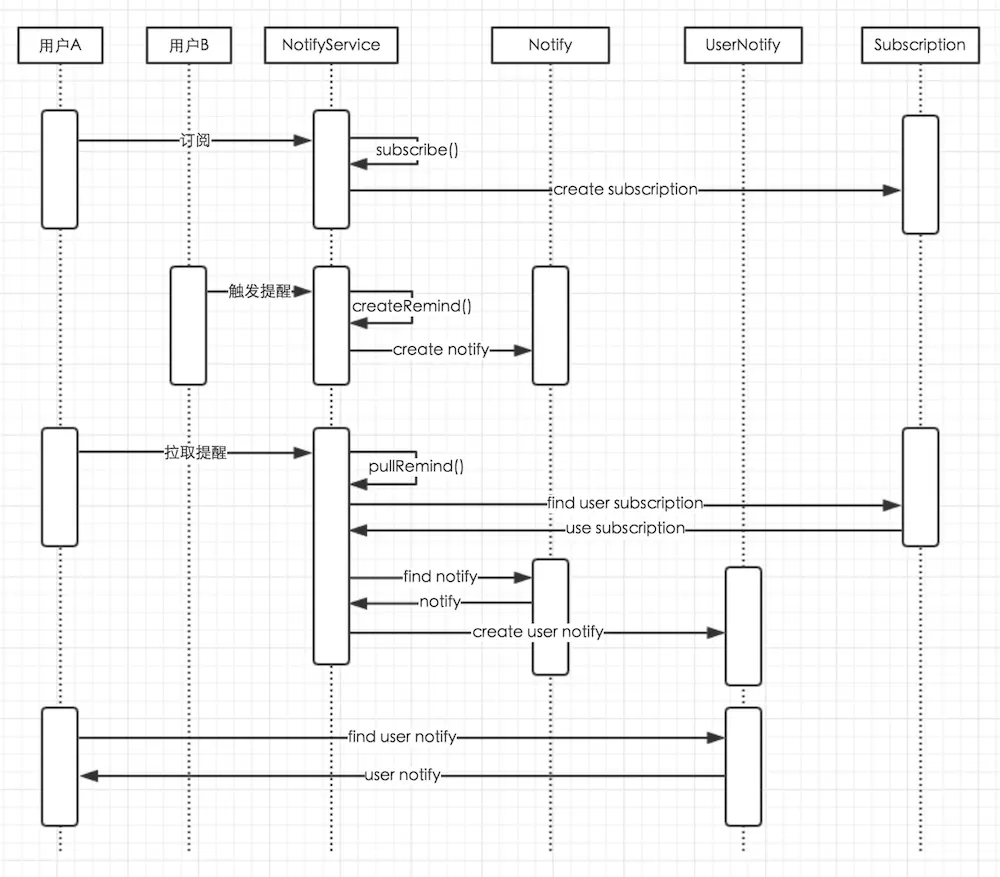

# Genius Forum System
## 文档结构
- 项目相关
- 进度记录
- 实现思路
- 资源合集
## 项目相关
### 代码约定
1. 重要的函数写注释，提高提高代码可读性
### 常量类的使用
1. 所有的字符常量，整型常量等都必须定义在Contants类中，关联性较大的一组常量封装到Contants中的一个内部类或者内部枚举类中
2. 常量定义用public static final修饰,内部类采用public static修饰
## 进度记录
### 【第八周】
- 进度：
    1. 完成了登录注册页，有基本的校验功能
    2. 完成的基本的数据库表格建立，并使用mybatis建立ORM模型
- TodoList

## 实现思路
### **敏感词过滤**
- 前缀树
- js脚本语言过滤，使用htmlUtils
### 标签系统
1. 建表构建映射关系
    - <tags，article_tags>
    - <articleId,article_tags>
2. 以articleId来水平分表再查询，提高查询效率
### 登录资格检查与session跟踪：
- 采用分发给Cookie的token值来作为用户的认证凭据，建立login_ticket表
- 使用采用threadLocal<User>的线程局部变量来缓存当前用户的信息，并存放在类HostHolder的static类变量中
- 采用Interceptor拦截器来进行用户登录资格的提前校验，并将登陆后的用户信息传给model进行页面渲染
### 用户关注关系设计
>参考
 https://blog.csdn.net/u012129558/article/details/52351522
  https://blog.csdn.net/u010098331/article/details/51445904

- 建表
    - followed被关注表：u1被u2关注
         u1
         u2
         status
         createTime
    - following关注表：u1关注u2
         u1
         u2
         status
     createTime
- mysql按u1进行水平分表并进行查询 [参考博文](https://blog.csdn.net/metal1/article/details/81670529)
- 后续考虑采用Redis进行数据缓存层的构建

### 站内私信实现思路
>参考博文：
 https://www.jianshu.com/p/f4d7827821f1
 https://www.jianshu.com/p/6bf8166b291c

#### 1.站内私信分类：
- 系统提醒：你的某个帖子收到了新的回帖，你的某个评论收到了新的评论，你的某个帖子收到了新的赞，你的评论被谁点赞了---这里还可以做一下信息聚合，同类型的信息组装一下
- 用户间的对话私信：两个用户之间的实时对话
- 公告：全站通告或者说是大范围的非个人化的通知，比如全站什么时间停服维护，请实名注册，我站改名等

#### 2.消息的获取方式
- 推PUSH：针对某个帖子维护一张关注者的列表，当满足问题推送的触发条件（比如有新的回帖）时，就把这个通知发送给每个关注者----信息和公告适合推的方式
- 拉PULL：每个用户都维护一张关注的帖子的列表，每当用户上线或者某个特定的周期的时候，就对列表中的帖子进行轮询，当帖子的时间列表出现了比我原本时间戳大的信息我就进行拉取----提醒

#### 3.提醒的形式化格式：
someone do sth in someone's sth 
someone : 提醒的触发者，或者发送者，标记为sender 
do sth ：提醒的动作，比如评论，点赞，回帖等，标记为action 
in somesone's ：下面的sth的所有者，即提醒动作作用的对象所有者，标记为targetOwner 
sth ：提醒动作作用的对象，标记为target 
我们项目中的可能的几种例子：

A评论了B的你的回帖***/你的评论***

A点赞了你的回帖***/你的主帖***/你的评论***
A回帖了你的主帖***
你收藏的主帖***有了新的回帖***
提取出来就是
sender是用户id
action就是评论/点赞/新回帖
target是主帖id/回帖id/评论id
targetOwner就是你自己
从这里可以设置一个订阅规则（当采用拉取方式时，我们需要维护一个关注某一事物的列表，这种行为成为订阅。我们称为A订阅了***）
于是从上面抽取出一下实体类：
1. 用户消息队列 UserNotify
2. 用户 User
3. 订阅 Subscription
4. 订阅设置 SubscriptionConfig
5. 消息 Notify
	1. 通告 Announce
	2. 提醒 Remind
	3. 信息 Message

#### 4.下面开始进行数据库建表和业务层接口设计
- 数据库建表
    Notify系列三个表
    Annouonce公告表
    Reminder提醒表
    Message私信表
    UserNotify用户消息队列表
    Subscription用户订阅规则表

- 服务层接口设计
    对于公告发布：（采用推方式）
    createAnounce()方法创建公告model实例
    createNotify( **,tpye=Announce)方法将公告model放入Announce表中
    createUserNotify()方法将刚刚插入的记录链接到用户消息队列表中的新纪录中
    refreshNotify()方法对用户消息队列表进行读取来更新当前的消息队列
    read()方法对当前消息进行阅读，将数据送到前端的同时更新后端数据库中该消息的hasRead字段

    对于私信对话：（采用推方式）
    createMessage()方法创建私信model实例
    createNotify(**,type=Message)方法将私信model放入Message表中
    createUserNotify()方法将刚刚插入的记录链接到用户消息队列表中的新纪录中
    refreshNotify()方法对用户消息队列表进行读取来更新当前的消息队列
    read()方法对当前消息进行阅读，将数据送到前端的同时更新后端数据库中该消息的hasRead字段

    对于提醒发布：（采用拉方式，所以分两个阶段，这里是系统端自动操作）
    提醒消息被触发，createReminder()，创建提醒model实例
    createNotify(**,type=Reminder)方法将提醒model放到Reminder表中
    对于提醒接收：（采用拉方式，所以分两个阶段，这里是用户端提交定时拉动作）
    初始化用户订阅规则setSubcription()/updateSubscription()，将用户的订阅规则提交到Subcription表中
    载入用户订阅规则loadSubscription()
    提交拉取请求pullReminder()
    根据订阅规则对Reminder表进行筛选findReminder()，将符合条件的记录插入到userNotify表中createUserNotify()
    refreshNotify()方法对用户消息队列表进行读取来更新当前的消息队列
    read()方法对当前消息进行阅读，将数据送到前端的同时更新后端数据库中该消息的hasRead字段
    往后定时进行上面的三步，不断地循环

- 用户层：
    设定定时任务定时进行用户消息队列刷新操作，即进行拉操作的同时刷新推方式推送的消息，汇总后一同发送到前端
    [参照博文](https://blog.csdn.net/do_bset_yourself/article/details/61425922)
    具体看时序图演示

    

    

### 后期爬虫爬取数据并采用分词框架进行分词分析和数据导入

## 资源合集
- spring mvc interceptor [拦截器实现原理](href:https://blog.csdn.net/xnf1991/article/details/53113519)
- java中管理常量的方法[参考博文](href:https://www.cnblogs.com/lihaoyang/p/6913295.html)
- 超棒的spring boot干货系列博文[链接](http://tengj.top/categories/Spring-Boot%E5%B9%B2%E8%B4%A7%E7%B3%BB%E5%88%97/)
- thymeleaf相关
    [基础语法1](https://blog.csdn.net/mygzs/article/details/52469770)
    [基础语法2](https://blog.csdn.net/mygzs/article/details/52472039)
    [遍历map对象](https://blog.csdn.net/u010999809/article/details/80726248?utm_source=blogxgwz1)

